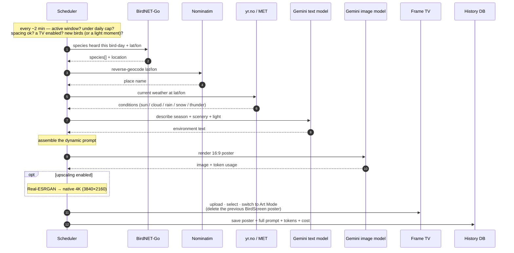

# BirdScreen

<p align="center">
  
</p>

Turn the birds you actually hear into a living watercolour on the wall.

BirdScreen listens to your garden with [BirdNET-Go](https://github.com/tphakala/birdnet-go),
and as birds drop by it paints them into a single watercolour field-guide poster — set in
your real location, season, time of day and weather — then hangs it on a **Samsung The Frame**
TV in Art Mode. As the day unfolds and new visitors arrive (and the light drifts from morning
to golden dusk, sun to rain), it quietly repaints, so the picture on your wall is always a
portrait of *today's* birds.

Under the hood it's a small **web app** (FastAPI + React): a background scheduler does the
watching and the painting, while a browser UI lets you follow the status, browse the gallery,
and tune everything. It's built to hum away unattended on a home server — a Mac Mini in a
closet is plenty.

> **Status: working end-to-end and automatic.** Listening → generating → displaying
> all run on their own. You configure it from the web UI; the scheduler does the rest.

---

## How it works



Everything is driven by structured, *dynamic* inputs so the image reflects the real moment:
the **season/foliage**, the **time-of-day light** (incl. Nordic white-night summer evenings),
and the **live weather** (sun/cloud/rain/snow/thunder) are each turned into descriptive text
and fed to the model. The poster is **full-bleed** with species labelled *next to each bird*.

## Examples

The same fjord, hours apart — BirdScreen repaints as the day's birds and the light change.
Bright mid-morning, then the long pastel glow of a Nordic *white-night* dusk near midnight:

<p align="center">
  
  
</p>

Each poster is one *dynamic* prompt, assembled from the live inputs — location, season,
time-of-day light, current weather and the day's species — and the full prompt is saved with
every poster. Here's the one behind the dusk plate above:

<details>
<summary>Show the prompt</summary>

```text
Create a 16:9 scientific field-guide illustration in the style of a classic ornithological reference plate — delicate pencil/graphite linework with soft, naturalistic watercolor washes.

Setting: the natural scenery around Trondheim, Norway — Coastal fjord landscape, forested hills, boreal spruce and pine, birch stands, rocky shorelines. It is midsummer, peak growing season (28 June 2026), and the local time is 23:44. The daylight right now is Bright twilight, 'white night' conditions, prolonged civil dusk, soft blue and pastel sky. Render the vegetation accordingly — Deciduous trees full vibrant green, conifers dark green, lush undergrowth, wildflowers blooming. The weather is mostly clear skies with only a few high clouds (about 20°C). CRUCIAL — the lighting must match this exact time of day and season: the sky colour, the height and warmth of the sun, the direction and length of shadows, and the overall brightness should all clearly read as this hour at this latitude (a luminous low-sun glow on long summer evenings, bright overhead midday light, dim blue twilight, or near-dark night, as appropriate). Keep the foliage, scenery and sky botanically and seasonally accurate for this place and time.

Feature the following birds, each accurately and recognisably rendered to scale and arranged naturally within a single cohesive scene (perched on branches, resting on shoreline rocks, wading, or in flight as best suits each species). Label each bird with a small serif caption placed directly beside or just below that bird, right next to it in the scene — do NOT gather the names into a list, key, legend or caption strip along the bottom or edge. Each caption shows the common name in Norwegian on top and the scientific (Latin) name beneath it in italics:
  - Tårnseiler (Apus apus)
  - Skjære (Pica pica)
  - Fiskemåke (Larus canus)
  - Blåmeis (Cyanistes caeruleus)
  - Bokfink (Fringilla coelebs)
  - Grønnsisik (Spinus spinus)
  - Ringdue (Columba palumbus)
  - Grønnfink (Chloris chloris)
  - Gråspurv (Passer domesticus)
  - Spettmeis (Sitta europaea)
  - Gråtrost (Turdus pilaris)
  - Trepiplerke (Anthus trivialis)
  - Sivhøne (Gallinula chloropus)
  - Vintererle (Motacilla cinerea)

Composition: one immersive watercolour scene that fills the entire frame. The landscape, foliage and sky must run right to and softly bleed off all four edges, the washes feathering organically into the paper at the margins. Use NO border, frame, panel, plate outline, vignette or clean rectangular margin — nothing should box the scene in; the artwork goes edge to edge. The birds are the clear focus among the natural foliage. Fine, detailed linework with gentle watercolor washes; no harsh outlines, no photographic realism, no text except the small per-bird species labels — no title, heading or list.
```

</details>

---

## Setting up on a server (macOS / Mac Mini)

This is the playbook to move BirdScreen onto the machine that runs BirdNET-Go.

**Prerequisites**
- macOS on Apple Silicon, with [`uv`](https://docs.astral.sh/uv/) and **Node.js** (for the web build).
- A running **BirdNET-Go** (see [below](#birdnet-go-the-audio-source)) — note its URL, e.g. `http://localhost:8080`.
- A **Gemini API key** (from <https://aistudio.google.com/apikey>).
- A **Samsung The Frame** TV **on the same LAN/subnet as this machine** (it must share the subnet — pairing/upload silently fails across subnets or a guest VLAN).

**Steps**

```bash
# 1. Clone + install Python deps (creates the venv, Python 3.13, incl. torch for upscaling)
git clone <repo-url> BirdScreen && cd BirdScreen
uv sync --extra web

# 2. Gemini API key
printf 'GEMINI_API_KEY=YOUR_KEY_HERE\n' > .env

# 3. Build the web UI (served by the backend)
cd frontend && npm install && npm run build && cd ..

# 4. Run the server (binds 0.0.0.0:8000 so it's reachable on the LAN)
uv run --extra web birdscreen-web
```

Then open **`http://<this-host>.local:8000`** (or `http://localhost:8000`) and finish in the UI:

5. **Settings** — set the BirdNET-Go URL, image model + size, upscaling, and weather. Location is read from BirdNET-Go automatically (or override the lat/lon).
6. **Schedule** — active hours (windows may cross midnight, e.g. `06:00–02:00`), the day-reset boundary (e.g. `04:00`), daily cap, debounce, and minimum spacing.
7. **TVs** — add the Frame's IP, tick **"Update this TV (push new posters)"**, click **Check status**, and **accept the "Allow" popup on the TV** to pair it (the TV must be awake / on a normal input). The auth token is cached in `.tv-token-<ip>`.
8. **Done** — the scheduler now renders and hangs a fresh poster automatically during active hours as new birds come in. Watch it on the **Status** page (it logs a heartbeat in **Logs** every couple of minutes).

**Keep it running 24/7.** macOS will sleep and suspend the server. Run it so the Mac stays awake while plugged in, e.g.:

```bash
caffeinate -is uv run --extra web birdscreen-web   # awake for the server's lifetime
# or set it globally:  sudo pmset -c sleep 0
```

Keep the Mac **plugged in** and (if a laptop) **lid open** — closing the lid sleeps it regardless.

> Per-machine state lives outside git: `config.yaml`, `data/birdscreen.db` (history), `posters/`,
> and `.tv-token*` / `.tv-art*`. So you configure each machine fresh via the web UI.

### Development

```bash
./scripts/dev.sh        # uvicorn --reload (:8000) + Vite HMR (:5173); open the :5173 URL
```

Quality gates (must stay green): `uv run ruff check src && uv run mypy && uv run pytest`,
and in `frontend/`: `npm run typecheck && npm run lint && npm run build`.

---

## The web app

| Page | What it shows / does |
|---|---|
| **Status** | "Right now" (active window, location, weather, BirdNET-Go, birds heard today, configured TVs), the next-poster state + reason, and the generation **history** (with prompt, tokens & est. cost). **Generate now** renders + hangs immediately. |
| **Gallery** | All posters, grouped by day; click for a framed lightbox that cross-fades between posters (◀ ▶ arrows / keyboard / swipe), with an info panel, the full prompt, and **Hang it on the wall**. |
| **Logs / Settings / Schedule / TVs** | Recent logs; and the config screens that write `config.yaml`. |

The scheduler's **stop conditions** are surfaced on the Status page like badges: *outside hours*,
*daily limit reached*, *cooling down*, and **no TVs active** (if no TV has "Update this TV" enabled,
nothing is generated). The UI is mobile-friendly (drawer nav, swipeable gallery).

## Configuration (`config.yaml`)

Written/read by the web UI; missing file → sensible defaults. Top-level sections:

- **`schedule`** — `day_reset`, `daily_cap`, `debounce_minutes`, `min_spacing_minutes`, `weekday_windows` / `weekend_windows` (each `start`/`end`, may cross midnight), and `light_refresh` (repaint at **midday / evening / dusk** to track changing light + weather even when no new birds arrive — sun times computed offline with [`astral`](https://github.com/sffjunkie/astral), bounded by the cap/spacing).
- **`settings`** — `model`, `image_size`, `upscale`, `birdnet_url`, `use_weather`, optional `latitude`/`longitude`.
- **`tvs`** — list of `{ name, ip, enabled, monitor_art_mode }`.
- **`pricing`** — per model `{ input, output }` USD per 1M tokens; used to record each generation's estimated cost. **Edit these to keep token prices current.**

`.env` holds `GEMINI_API_KEY` (required) and optional `BIRDSCREEN_IMAGE_MODEL` / `BIRDSCREEN_TEXT_MODEL`.
Weather (yr.no/MET) and geocoding (Nominatim) are keyless; set `BIRDSCREEN_USER_AGENT` to your own
contact (a site or email) to comply with [MET's Terms of Service](https://api.met.no/doc/TermsOfService).
Set `BIRDSCREEN_NO_SCHEDULER=1` to run the web app without the auto-generation loop.

## CLI tools (manual / dev)

A [uv](https://docs.astral.sh/uv/) project (package `birdscreen`, `src/` layout). The web app is
the normal way to run it; these commands are handy for one-offs and debugging:

| Command | What it does |
|---|---|
| `birdscreen-web` | Run the web app + scheduler (serves `frontend/dist`) |
| `make-poster` | Full pipeline from explicit inputs → prompt → image → (upscale/labels) → file (+ optional `--tv`) |
| `build-prompt` | Build + print the prompt only |
| `generate-poster` | Generate an image from a raw prompt |
| `upscale` | Real-ESRGAN super-resolution to native 4K |
| `check-tv` / `upload-art` | Identify/verify a Frame TV; upload + display an image |

Posters are saved to `posters/` with a lexically-sortable timestamp name (e.g.
`2026-06-28T214530.jpg`); all metadata (model, inputs, full prompt, tokens, cost) lives in the
history DB, not the filename.

## Image models

Gemini's native image models ("Nano Banana"). Default is **`gemini-3-pro-image`** (Pro) — richest
linework and correct captions beside each bird. Pricing is image-output per 1M tokens; lowering Pro's
resolution barely lowers its cost (a roughly fixed reasoning-token pool), so render Pro at 4K.

| Model | Per image | Craft | Text / labels |
|---|---|---|---|
| **`gemini-3-pro-image`** (Pro) | ~$0.21–0.33 | ★★★ | ✅ correct, beside each bird |
| `gemini-2.5-flash-image` | ~$0.039 | ★★ | ❌ garbled — pair with `--no-labels` + our composited labels |

## Super-resolution

The Frame panel is native **3840×2160**. Pro at 4K renders larger → downscaled crisp; Flash renders
~1 MP → upscaled with **Real-ESRGAN** (`RealESRGAN_x4plus`) via
[spandrel](https://github.com/chaiNNer-org/spandrel) + PyTorch on the Apple GPU (MPS), tiled. It's a
restoration model, not a plain resize. Weights auto-download to `models/` on first use. (torch/spandrel
are now regular dependencies, so upscaling works from the web app.)

## Samsung The Frame TVs

Uses [`samsungtvws`](https://github.com/xchwarze/samsung-tv-ws-api). When hanging a poster, BirdScreen
uploads, selects it, switches to Art Mode, and **deletes only its own previous upload** (tracked per-TV
in `.tv-art-<ip>`) — your personal photos on the TV are never touched. Add your TV by IP in the **TVs**
page; pairing caches a token in `.tv-token-<ip>`.

Two generations behave differently and both are handled automatically:
- **Newer Frames** (2022+, Art API 5.x) use the standard D2D-socket upload.
- **Older Frames** (2017-era, Art API 1.x) need the single-frame WebSocket-binary upload fallback.

Notes for the **older 2017-era Frame**: it rejects the modern D2D upload (we fall back automatically); it sends a
reserved `1005` websocket close that newer `websocket-client` rejects (we tolerate it); the **Allow**
popup only appears when the TV is **awake / on a normal input** (not Art Mode), and won't re-prompt for
a remembered client — if pairing is stuck, remove the client under *Settings → General → External Device
Manager → Device Connection Manager* and retry.

---

## BirdNET-Go (the audio source)

BirdNET-Go does the real-time bird-sound identification; BirdScreen reads the day's detections from its
HTTP API (`/api/v2/...`). Installed as a manual binary on macOS (Apple Silicon).

| Component | Location |
|---|---|
| Binary | `~/birdnet-go/birdnet-go` |
| Libraries (system-wide) | `/usr/local/lib/libonnxruntime.dylib`, `…/libtensorflowlite_c.dylib` |
| Config | `~/.config/birdnet-go/config.yaml` |
| Web dashboard / API | <http://localhost:8080> |

```bash
brew install ffmpeg sox
mkdir -p ~/birdnet-go && cd ~/birdnet-go
curl -fL -o birdnet-go-darwin-arm64.tar.gz \
  https://github.com/tphakala/birdnet-go/releases/latest/download/birdnet-go-darwin-arm64.tar.gz
tar xzf birdnet-go-darwin-arm64.tar.gz
sudo cp libonnxruntime.dylib libtensorflowlite_c.dylib /usr/local/lib/
```

> [!IMPORTANT]
> **macOS rpath fix (required).** The binary references `@rpath/…` libraries but ships with **no
> `LC_RPATH`**, so on recent macOS it crashes at launch. Fix it (no `sudo`), and **re-apply after any
> update**:
> ```bash
> install_name_tool -add_rpath /usr/local/lib ~/birdnet-go/birdnet-go
> codesign -f -s - ~/birdnet-go/birdnet-go
> ```

```bash
~/birdnet-go/birdnet-go serve     # → http://localhost:8080  (set your lat/lon in its config)
```

## Project layout

| Module | Purpose |
|---|---|
| `web/app.py` | FastAPI app + the background auto-generation scheduler |
| `engine.py` | Pure scheduling rules (windows, cap, spacing, stop conditions) |
| `generate.py` | One automatic/manual generation → poster + history record |
| `birdnet.py` | BirdNET-Go client (bird-day species, location) |
| `state.py` | SQLite history (generations; migrated additively) |
| `config.py` | `config.yaml` model (schedule / settings / TVs / pricing) |
| `poster.py` / `gemini.py` / `season.py` / `weather.py` / `geocode.py` | Dynamic prompt + image + the location/season/weather inputs |
| `images.py` / `upscale.py` / `labels.py` | Frame-fit, Real-ESRGAN, composited labels |
| `samsung_tv.py` | Frame TV connect / upload / replace |
| `usage.py` | Token-usage + cost helpers |
| `pipeline.py` | CLI end-to-end orchestration (`make-poster`) |

## License

MIT — see [LICENSE](LICENSE). Contributions welcome.

## References

- BirdNET-Go: <https://github.com/tphakala/birdnet-go>
- Gemini image generation: <https://ai.google.dev/gemini-api/docs/image-generation>
- samsung-tv-ws-api: <https://github.com/xchwarze/samsung-tv-ws-api>
- Real-ESRGAN: <https://github.com/xinntao/Real-ESRGAN> · spandrel: <https://github.com/chaiNNer-org/spandrel>
- yr.no / MET Norway: <https://api.met.no/> · Nominatim: <https://nominatim.org/>
